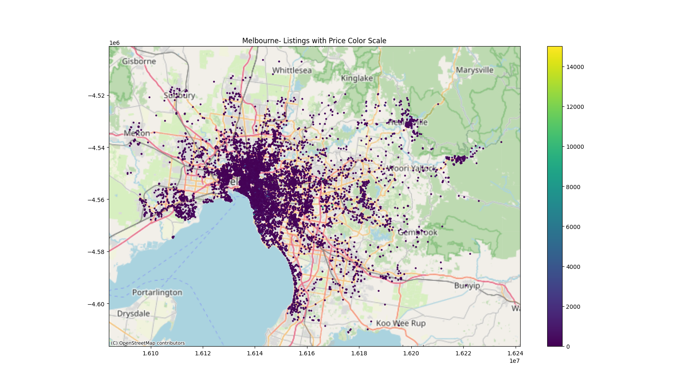
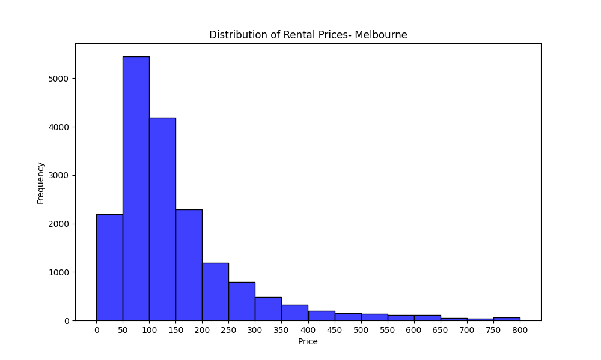
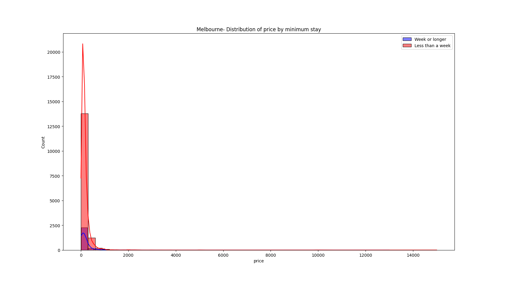
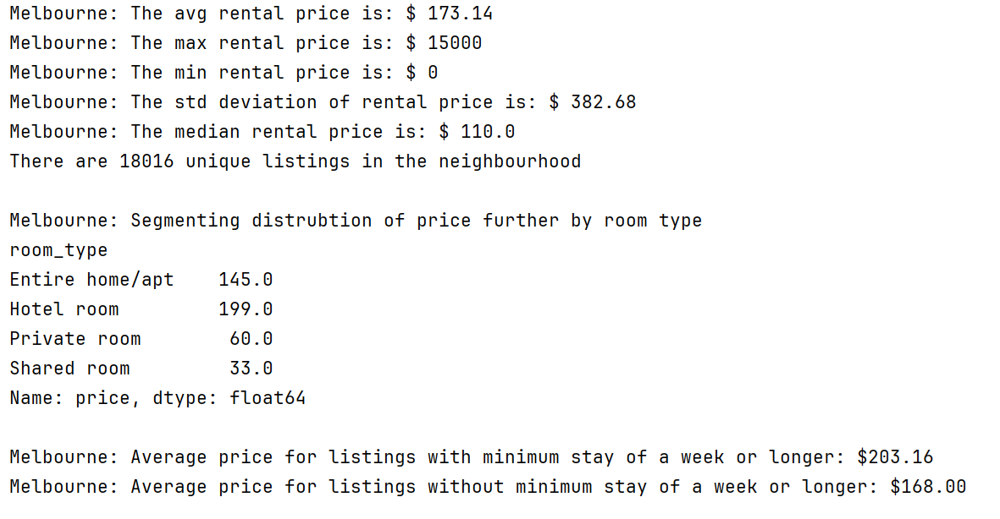

# AirbnbNavigator
A comprehensive analysis of Airbnb listings across six cities, exploring price trends, geographic distributions, and insights into rental patterns and professional hosting.

## Airbnb Price Analytics and Insights Across Cities

### Project Description:
This project analyzes Airbnb listings data for six cities: **Melbourne**, **Austin**, **Bangkok**, **Buenos Aires**, **Cape Town**, and **Istanbul**. The analysis includes:

- **Price Distributions**: Understand rental price trends across neighborhoods.
- **Geographic Visualizations**: Maps with price-based color scales.
- **Trends Analysis**: based on room type, minimum stay durations, and professional hosting patterns.

The goal is to uncover valuable insights for renters and property managers, highlighting trends and anomalies in the rental data.

##### Geographic map with price-based color scales for cities:



##### Distribution of rental prices (hisogram):



##### Distribution of price by minimum stay:


##### Terminal Output:


#### Dependencies:
The project requires the following Python libraries:

- **pandas**: For data manipulation and analysis.
- **numpy**: For numerical computations.
- **matplotlib**: For creating static visualizations.
- **seaborn**: For statistical data visualization.
- **geopandas**: For geospatial data analysis.
- **contextily**: For adding basemaps to geospatial visualizations.
  
## Steps to Run the Project:

#### 1. Clone the Repository:
```
git clone  https://github.com/HabibAliShah/AirbnbNavigator.git
```

```
cd AirbnbNavigator
```

#### 2. Install Dependencies: Install the required Python libraries using pip:

```
pip install pandas numpy matplotlib seaborn geopandas contextily
```

#### 3. Prepare the Data: Ensure the data files are placed in the data/ directory with the following filenames:

- listings_melbourne.csv
- listings_austin.csv
- listings_bangkok.csv
- listings_buenos_aires.csv
- listings_cape_town.csv
- listings_istanbul.csv

#### 4. Run the Analysis: Execute the Python script:

```
python AirbnbProject.py
```

#### Explore the Outputs:

- **Histograms:** Distribution of rental prices.
- **Maps:** Geospatial visualization of listings with price-based color scales.
- **Summary Statistics:** Insights into average, median, and range of rental prices segmented by room type and minimum stay requirements.

#### 4. Report: 
Refer to the included PDF report (Intermediate_Answers_Airbnb_Analysis.pdf) for detailed findings and additional analysis highlights.
